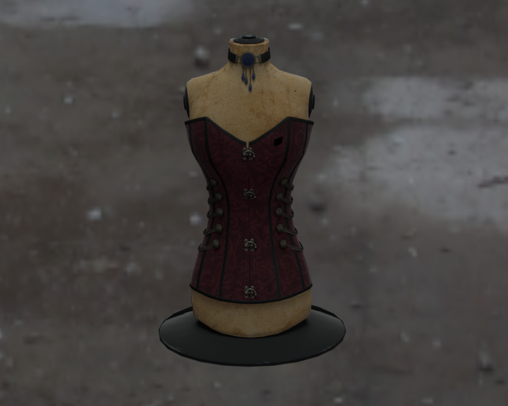
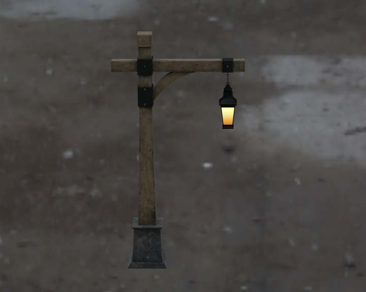

<h2 align=center>
gltf-blender-importer

</h1>

Un-official Blender importer for glTF 2.0.

### Installation

Click the "Download Add-on" button above to download the ZIP containing the
add-on. In Blender, navigate to **File > User Preferences... > Add-ons** (or
**Edit > User Preferences... > Add-ons**) and install that ZIP with the
**Install Add-on from File...** button (or **Install...** button). Then type
'glTF' in the search bar and tick the checkbox next to **KSons' glTF 2.0
Importer** to enable it.

You can now import glTFs with **File > Import > KSons' glTF 2.0 (.glb/.gltf)**.

See [INSTALL.md](INSTALL.md) for further installation instructions.

### Supported Extensions
* EXT_property_animation (tentative until stabilized, material properties only)
* KHR_lights_punctual
* KHR_materials_pbrSpecularGlossiness
* KHR_materials_unlit
* KHR_texture_transform
* MSFT_texture_dds

### Samples Renderings

### See also

Official Importer-Exporter: [glTF-Blender-IO](https://github.com/KhronosGroup/glTF-Blender-IO)
