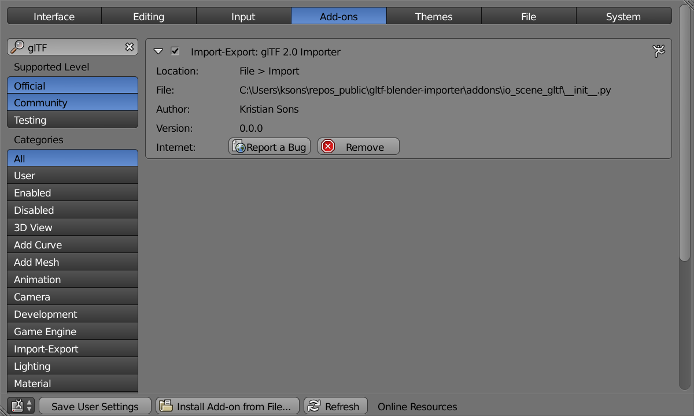

# gltf-blender-importer

Blender importer for glTF 2.0.

## Installation
Blender =2.79 is recommended.

Find the latest archive here:

You can install the archive using the ``Install from File...`` button in ``File->User preferences...->Add-ons``.
After installing you have to find the add-on and activate it.

After this procedure, the exporter is available from  ``File->Import->glTF JSON (.gltf/.glb)``.

See [INSTALL.md](INSTALL.md) for further installation instructions.

## Samples Renderings

